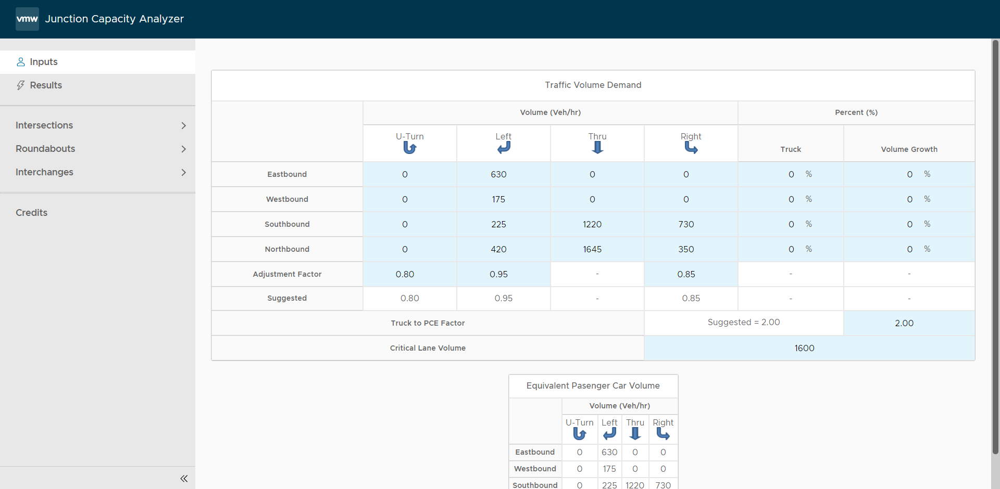
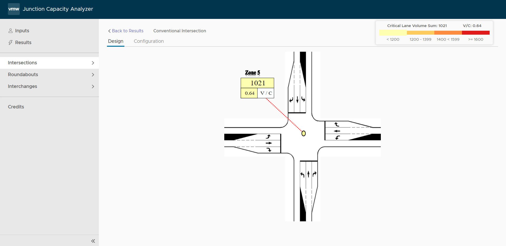
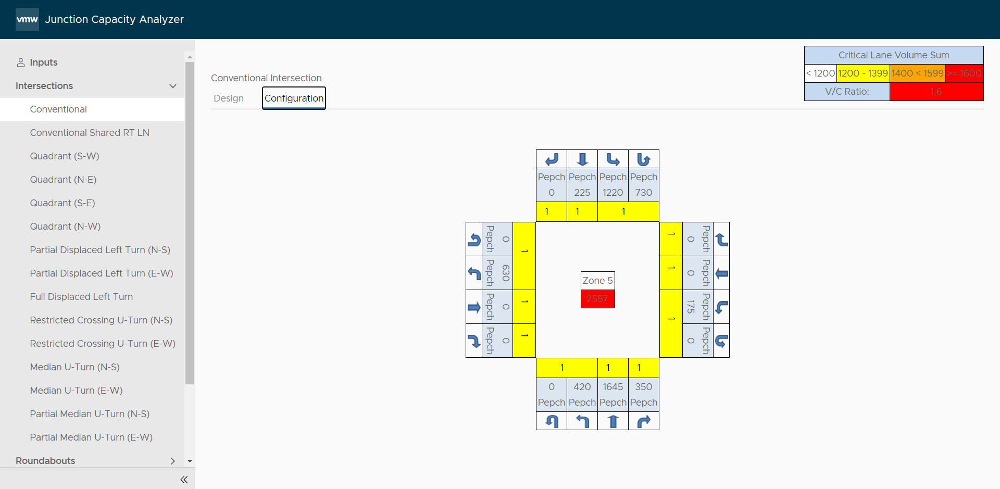
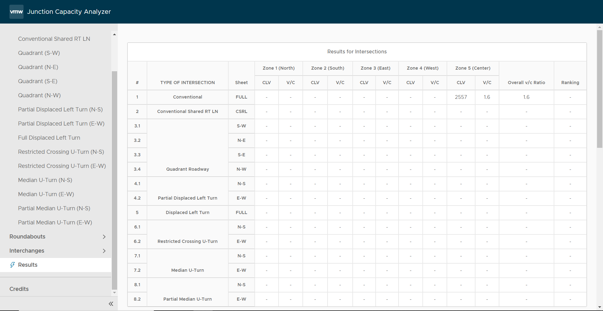

# Junction Capacity Analyser

This project is free to use for personal, non profit research and free open-source projects. kindly contact developer and maintainer Yogesh Dhanapal @ geoyogesh@gmail.com for commercial and enterprise use cases. 

## Hosted application

[http://jcapacityanalyzer.com.s3-website-us-east-1.amazonaws.com/](http://jcapacityanalyzer.com.s3-website-us-east-1.amazonaws.com/)

## User Guide

1. Go to Input and input the yellow boxes

1. Go to junction and view the design

1. Navigate to configuration section of the junction and update lane information in yellow boxes

1. review the results

## Credits

Tool | Link
------------ | -------------
CAPX | [https://www.fhwa.dot.gov/software/research/operations/cap-x/](https://www.fhwa.dot.gov/software/research/operations/cap-x/)
Angular | [https://angular.io/](https://angular.io/)
Clarity | [https://clarity.design/](https://clarity.design/)
Angular Flex Layout | [https://github.com/angular/flex-layout](https://github.com/angular/flex-layout)
MathJs | [https://mathjs.org/](https://mathjs.org/)
rxjs | [https://rxjs-dev.firebaseapp.com/](https://rxjs-dev.firebaseapp.com/)
Typescript | [https://www.typescriptlang.org/](https://rxjs-dev.firebaseapp.com/)
@jefiozie/ngx-aws-deploy | [https://github.com/Jefiozie/ngx-aws-deploy#readme](https://github.com/Jefiozie/ngx-aws-deploy#readme)
Adobe Illustrator | [https://www.adobe.com/products/illustrator.html](https://www.adobe.com/products/illustrator.html)
